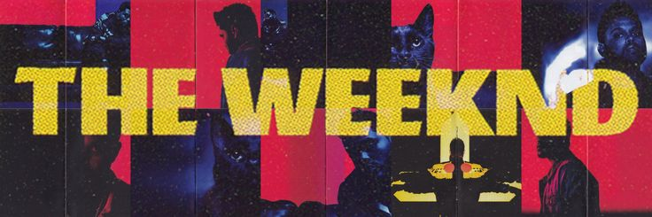
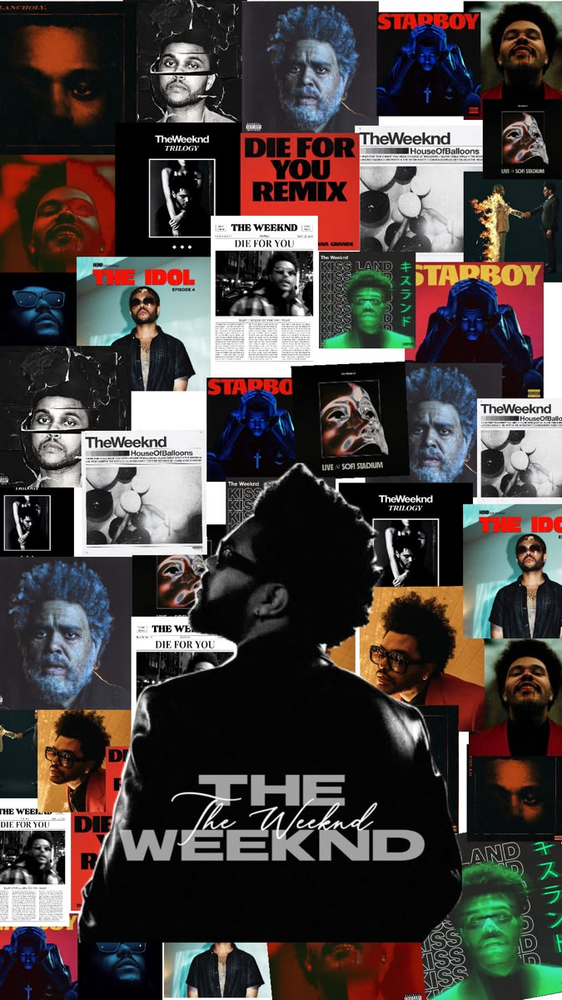
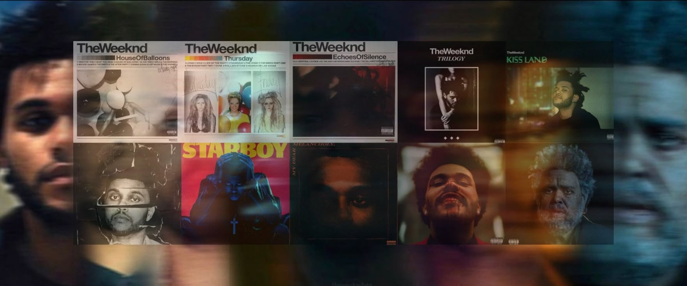

# The Weeknd — After Hours



A moody, full-screen "midnight broadcast" music player built with Next.js, React, and Tailwind CSS. It streams a YouTube playlist through a hidden IFrame player behind a cinematic, retro-radio interface — complete with a live clock, rotating quotes, a scanline/grain-textured backdrop, and a tap-to-record easter egg.

  

---

## Preview

<table>
  <tr>
    <td align="center" width="35%">
      
      <br /><sub><b>Mobile</b> (&lt; 768px)</sub>
    </td>
    <td align="center" width="65%">
      
      <br /><sub><b>Desktop</b> (&ge; 768px)</sub>
    </td>
  </tr>
</table>

---

## Features

- 🎧 **Full YouTube playlist playback** via the YouTube IFrame Player API (audio-first, video hidden)
- 🌆 **Responsive hero artwork** — a portrait collage on mobile, a wide desktop collage on larger screens
- 🕑 **Live clock** and a rotating set of atmospheric quotes
- 📼 **Tap-to-record easter egg** — tapping the artwork triggers a short "REC" toast and a subtle glitch/beep effect
- 🎚️ Custom transport controls: play/pause, next/previous, seek, volume, and mute
- 📱 **Mobile-first responsive design** — a distinct, simplified desktop layout (no playlist sidebar; larger typography and a centered player) versus a compact full-bleed mobile layout
- 🎨 Film-grain overlay, scanlines, and a layered vignette for a broadcast/VHS aesthetic
- 🧩 Fully componentized codebase with all player logic isolated in a single custom hook

---

## Tech Stack

| Layer     | Choice                                                                                  |
| --------- | --------------------------------------------------------------------------------------- |
| Framework | [Next.js 14](https://nextjs.org/) (App Router)                                          |
| UI        | [React 18](https://react.dev/)                                                          |
| Styling   | [Tailwind CSS 3](https://tailwindcss.com/)                                              |
| Playback  | [YouTube IFrame Player API](https://developers.google.com/youtube/iframe_api_reference) |
| Fonts     | Bebas Neue, Playfair Display, DM Mono (Google Fonts)                                    |

No backend, database, or API keys are required — everything runs client-side.

---

## Getting Started

### Prerequisites

- [Node.js](https://nodejs.org/) 18.17 or later
- npm (bundled with Node)

### Installation

```bash
# 1. Unzip / clone the project, then move into it
cd weeknd-after-hours

# 2. Install dependencies
npm install

# 3. Start the dev server
npm run dev
```

Open [http://localhost:3000](http://localhost:3000) in your browser.

### Production build

```bash
npm run build
npm run start
```

---

## Project Structure

```
.
├── app/
│   ├── layout.js                  # Root HTML shell + page metadata
│   ├── page.js                    # Composes the whole page from components
│   ├── globals.css                # Tailwind directives + a few complex gradient/texture classes
│   ├── hooks/
│   │   └── useBroadcastPlayer.js  # All state + YouTube IFrame API logic (clock, quotes, transport, glitch fx)
│   └── components/
│       ├── YouTubeMount.jsx       # Hidden mount point for the YouTube player
│       ├── Backdrop.jsx           # Blurred full-bleed background wash
│       ├── HeroImage.jsx          # Tappable hero artwork (responsive image swap)
│       ├── Overlays.jsx           # Shade (vignette), Scanlines, Grain texture
│       ├── Rails.jsx              # Decorative vertical side text (desktop only)
│       ├── TopLine.jsx            # Live clock + signal readout
│       ├── Header.jsx             # "THE WEEKND" title block
│       ├── ArchiveCard.jsx        # Decorative archive blurb (desktop only)
│       ├── RecordedBadge.jsx      # "RECORDED AT ..." toast
│       ├── Quote.jsx              # Rotating italic quote
│       └── Player.jsx             # Artwork, progress bar, transport controls, playlist link
├── public/
│   ├── weeknd-wallpaper.jpeg      # Hero/backdrop image — used below the md breakpoint (mobile)
│   ├── weeknd-collage.jpeg        # Hero/backdrop image — used at md breakpoint and up (desktop)
│   └── readme/                    # Images used only in this README, not by the app itself
│       ├── weeknd-portrait.jpeg   # Mobile preview screenshot/image
│       ├── weeknd-banner.jpeg     # README banner
│       └── weeknd-desktop.jpeg    # Desktop preview screenshot/image
├── tailwind.config.js             # Custom keyframes/animations, fonts, colors
├── postcss.config.js
├── next.config.js
└── package.json
```

---

## Configuration

### Changing the playlist

Update the playlist ID at the top of `app/hooks/useBroadcastPlayer.js`:

```js
const PLAYLIST_ID = "PLlWZj99fwdl88EcZDDU3ubcIYOhiUCvp-";
```

Any public YouTube playlist ID will work.

### Changing the artwork

Replace the two images in `public/` (keep the same filenames, or update the references in `Backdrop.jsx` and `HeroImage.jsx`):

- `weeknd-wallpaper.jpeg` — portrait/vertical image shown on mobile
- `weeknd-collage.jpeg` — wide/landscape image shown on desktop (≥ 768px)

### Changing the quotes

Edit the `QUOTES` array in `app/hooks/useBroadcastPlayer.js`. They rotate automatically every 3.6 seconds.

### Breakpoints

The layout switches between mobile and desktop compositions at Tailwind's `md` breakpoint (768px). Adjust this in `tailwind.config.js` if you need a different cutoff.

---

## Responsive Behavior

| Screen size         | Layout                                                                                                                                                                                                                  |
| ------------------- | ----------------------------------------------------------------------------------------------------------------------------------------------------------------------------------------------------------------------- |
| `< 768px` (mobile)  | Full-bleed portrait artwork, compact header, quote + player pinned near the bottom of the screen, no side rails or playlist                                                                                             |
| `≥ 768px` (desktop) | Full-bleed wide artwork, larger title with a decorative archive card beside it, centered wider player card, decorative side rails. Playlist sidebar is intentionally omitted — use the transport buttons to skip tracks |

---

## Browser Support

Works in all modern evergreen browsers (Chrome, Firefox, Safari, Edge). Autoplay is intentionally disabled — playback starts on user interaction (tapping play), in line with browser autoplay policies.

---

## Notes & Limitations

- Playback depends on the YouTube IFrame API being reachable and the configured playlist remaining public.
- The "record" effect is purely visual/audio flavor — it does not actually record or save anything.
- No data is persisted; refreshing the page resets the player.

---

## 👨‍💻 Author

**Nitish Bharti**

- GitHub: https://github.com/coder-nik200
- LinkedIn: https://www.linkedin.com/in/nitish-kumar-bharti-631a37359/
- Portfolio: https://portfolio-puce-six-7fnmze2rme.vercel.app/

---

## 📄 License

This project is licensed under the MIT License.

---

## ⭐ Support

If you found this project helpful, please consider giving it a ⭐ on GitHub.
